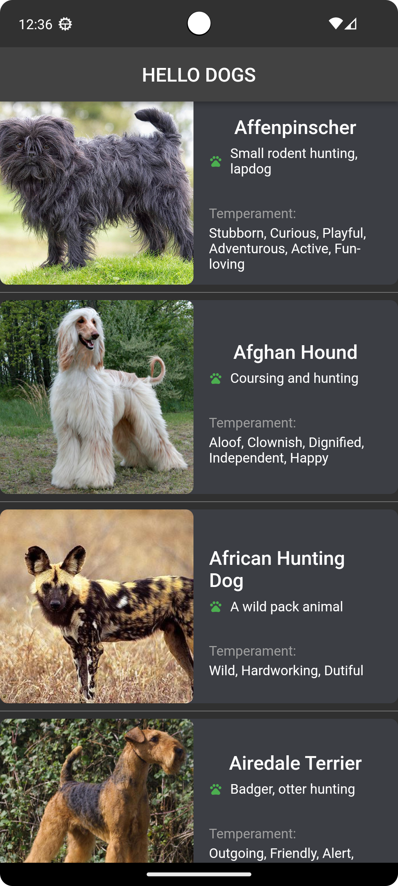
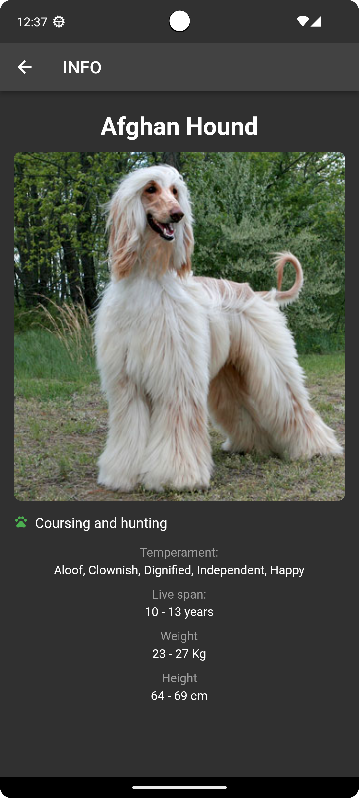
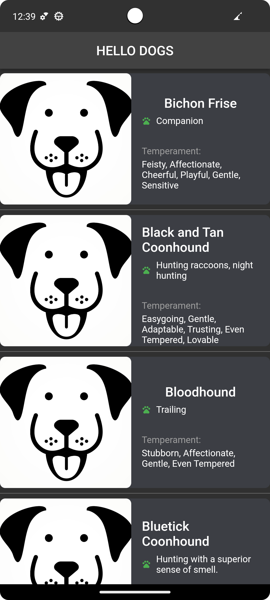

# dog_breed_app_with_clean_architecture

# Описание проекта

**Практическая работа по изучению чисой архитектуры с использованием свободного API сайта https://www.thedogapi.com/, и стейтменеджмента Bloc Cubit, фрэймворк Flutter.**

|            Главное меню             |     Полная информация о породе      |        Кеширование изображений        |
|:-----------------------------------:|:-----------------------------------:|:-------------------------------------:|
|  |  |  |

